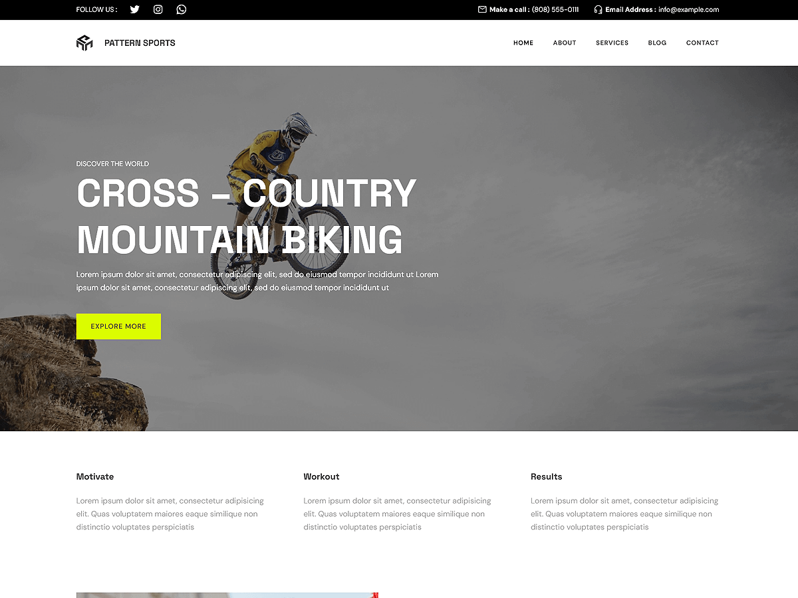

# Patterns Sports

Patterns Sports is a dynamic and professional WordPress theme crafted for gyms, sports clubs, fitness centers, and athletic organizations. Built with WordPress Full Site Editing (FSE), this theme offers seamless customization of headers, footers, templates, and global styles directly within the WordPress Site Editor.The theme includes pre-designed patterns and layouts tailored for showcasing training programs, coach profiles, event schedules, class timetables, testimonials, photo galleries, and contact details. It features dedicated sections for services, about the facility, membership plans, galleries, team introductions, testimonials, booking forms, and more. With a responsive design that looks sharp on all devices, Patterns Sports provides a powerful and engaging platform to connect with your community and promote an active lifestyle.

Primary color: `#000000`.



## Features

- 3 hero and landing patterns
- 5 card layouts (card-1 through card-5)
- 1 service section pattern
- 5 archive/post-listing patterns
- Contact page pattern (page-contact)
- 1 menu navigation pattern
- 14 section layout patterns (featured sections and section titles)
- Full Site Editing (FSE) support
- Responsive design
- 66 block patterns + 15 templates + 11 template parts
- Sports-oriented layouts (teams, events, schedules)

## Requirements

- WordPress 6.6 or higher
- PHP 7.0 or higher
- Tested up to WordPress 6.7

## Development

This theme uses `@wordpress/scripts`:

```sh
npm install
npm run start    # dev mode with watch
npm run build    # production build
```

## License

GNU General Public License v2 or later.

This theme is based on [WP Block Theme Boilerplate](https://github.com/codersantosh/wp-block-theme-boilerplate), (C) 2025 Santosh Kunwar, [GPLv2 or later](https://www.gnu.org/licenses/gpl-2.0.html).
